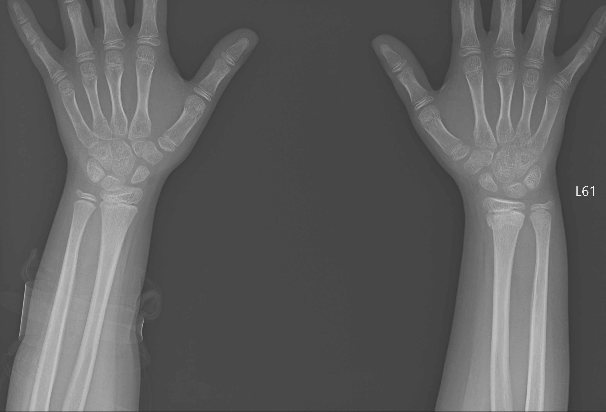

# <p align="center">L-T AI ML Healthcare Project</p>

<p align="center">
  <a href="#"></a>
  <a href="#"></a>
  <a href="#"></a>
  <a href="#"></a>
  <a href="#"></a>
</p>

An **AI/ML healthcare project** that detects **bone fractures from X-ray images** and predicts **cholesterol levels** using patient data such as **blood pressure (BP), BMI, and WBC count**.  

---

## 📌 Table of Contents
1. [Key Features](#key-features)  
2. [Installation Guide](#installation-guide)  
3. [Usage](#usage)  
4. [Project Structure](#project-structure)  
5. [Screenshots](#screenshots)  
6. [Technologies Used](#technologies-used)  
7. [License](#license)  

---

## 🚀 Key Features

- 🩻 **Fracture Detection**: Upload an X-ray and let the CNN model detect fractures.  
- 🧪 **Cholesterol Prediction**: Input health data like BP, BMI, and WBC count to estimate cholesterol levels.  
- 📊 **Model Training**: Includes scripts to retrain/update both models.  
- 🌐 **Web Interface**: Flask app for real-time predictions with simple UI.  

---

## ⚙️ Installation Guide

1. **Clone the Repository**

```
git clone https://github.com/Rashisha14/L-T-AI-ML.git
cd L-T-AI-ML
```

2. **Create Virtual Environment & Install Dependencies**
```
python3 -m venv venv
On Windows use: venv\Scripts\activate
source venv/bin/activate
pip install -r requirements.txt
```

3. **Run the Flask App**
```
python app.py
```

4. **Open in your browser**
Open http://localhost:5000 manually in your browser

## ▶️ Usage

Fracture Detection → Upload an X-ray image → Model highlights fracture presence.

## 📂 Project Structure
```
L-T-AI-ML/
├── app.py                  # Flask app entry point (runs the web interface)
├── train1.py               # Train fracture detection model on X-ray dataset
├── train2.py               # Train cholesterol prediction model on patient data
│
├── models/                 # Saved ML models (.pkl / .h5)
│   ├── fracture_model.h5
│   └── cholesterol_model.pkl
│
├── data/                   # Datasets (CSV / X-ray images)
│   ├── fracture_dataset/
│   ├── cholesterol_data.csv
│   └── processed/
│
├── templates/              # HTML templates for Flask frontend
│   ├── index.html
│   ├── result_fracture.html
│   └── result_cholesterol.html
│
├── static/                 # Static files (CSS, JS, images)
│   ├── css/
│   │   └── style.css
│   ├── js/
│   │   └── script.js
│   └── uploads/            # Uploaded X-ray demo images
│
├── notebooks/              # Jupyter notebooks for experimentation
│   ├── fracture_detection.ipynb
│   └── cholesterol_prediction.ipynb
│
├── requirements.txt        # Python dependencies
├── README.md               # Project documentation
└── LICENSE                 # License information
```


## 🖼 Screenshots

**Fracture Detection**
<p align="center">  </p>

**Cholesterol Prediction**
<p align="center">  </p>


## 🛠 Technologies Used
<p align="center"> <a href="#"></a> <a href="#"></a> <a href="#"></a> <a href="#"></a> <a href="#"></a> </p>

**Language:** Python

**Framework:** Flask

**Libraries:** TensorFlow, Keras, Scikit-Learn, OpenCV, NumPy, Pandas

## 📜 License

MIT License

<p align="center"> <a href="https://opensource.org/licenses/MIT"></a> </p>
